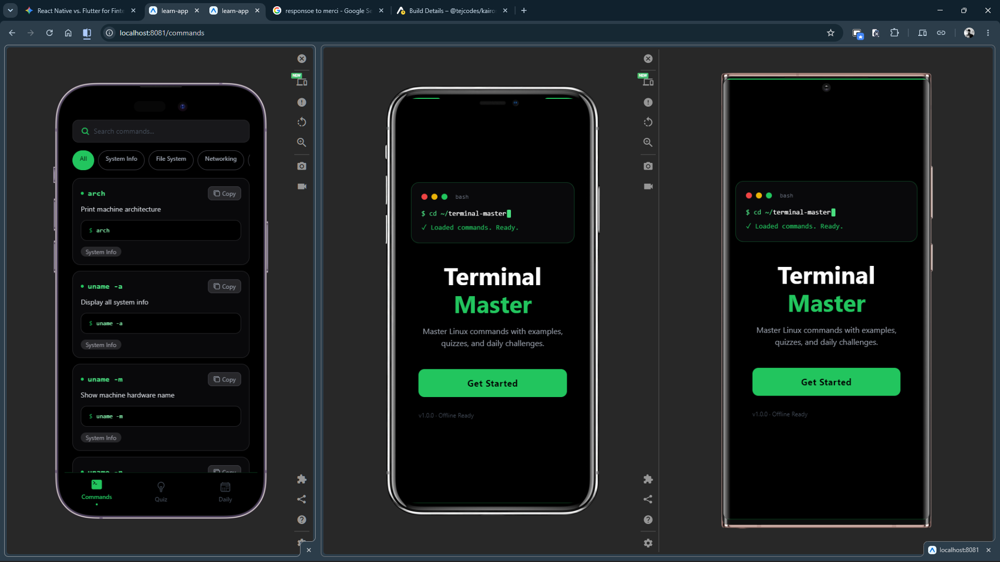
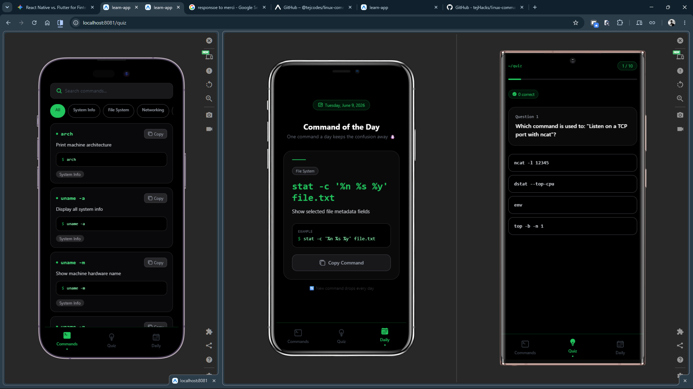

# Terminal Master - Linux Commands Reference App

Master Linux commands with examples, quizzes, and daily challenges. A feature-rich React Native app built with Expo and Tailwind CSS.


## � Screenshots




## �📱 Overview

A mobile app featuring **400+ Linux commands** with search, category filters, quizzes, and a daily command challenge. Optimized for Android 8.1+ with a lean **20-25 MB APK**.

## ✨ Features

- **Searchable Commands**: 400+ Linux commands with descriptions and examples
- **Category Filtering**: Browse by System Info, File System, Networking, Permissions, Process, Text, and more
- **Daily Challenge**: One new command per day to keep learning
- **Quiz Mode**: Test your knowledge with randomized multiple-choice questions
- **Copy to Clipboard**: Quickly copy command examples
- **Dark Terminal UI**: Custom black/green theme mimicking a real terminal
- **Offline Ready**: Works without internet connection

## 🛠 Tech Stack

- **Framework**: React Native with Expo
- **Styling**: Tailwind CSS + NativeWind
- **Routing**: Expo Router
- **State Management**: React Hooks
- **Icons**: Ionicons from Expo Vector Icons
- **Build**: EAS Build (Expo Application Services)

## 🚀 Getting Started

### Prerequisites
- Node.js 18+
- npm or yarn
- Expo CLI

### Installation

```bash
# Clone the repository
git clone https://github.com/tejHacks/linux-commands-mobile-app.git
cd linux-commands-mobile-app

# Install dependencies
npm install

# Start the development server
npx expo start
```

### Build APK

```bash
# Build for Android
npx eas build -p android --profile production --wait

# APK will be available at the EAS build dashboard
```

## 📋 Project Structure

```
app/
  ├── index.tsx              # Home/Landing page
  ├── commands.tsx           # Commands browser & search
  ├── quiz.tsx              # Quiz mode
  ├── daily.tsx             # Daily command challenge
  ├── onboarding.tsx        # Onboarding flow
  └── _layout.tsx           # Router layout

components/
  └── Navbar.tsx            # Bottom navigation

data/
  └── commands.ts           # 400+ Linux commands database

assets/images/
  └── download.png          # App icon
```

## 🎯 Key Challenges Solved

- ✅ Reduced APK size to 20-25 MB using Gradle optimizations
- ✅ Fixed FlatList performance with category filters
- ✅ Implemented dark mode terminal UI with NativeWind
- ✅ Randomized quiz question generation
- ✅ Daily command rotation based on date

## 📊 Commands Database

Categories included:
- System Info
- File System
- Networking
- Permissions
- Process Management
- Text Processing
- Package Management
- Archives
- Disk Management
- Environment Variables

## 🔗 Links

- **GitHub**: [https://github.com/tejHacks/linux-commands-mobile-app](https://github.com/tejHacks/linux-commands-mobile-app)
- **Expo Project**: [Expo Learn App](https://expo.dev/@tejcodes/learn-app)
- **Demo**: Coming soon

## 📄 License

MIT License - Feel free to use this project for personal or commercial purposes.